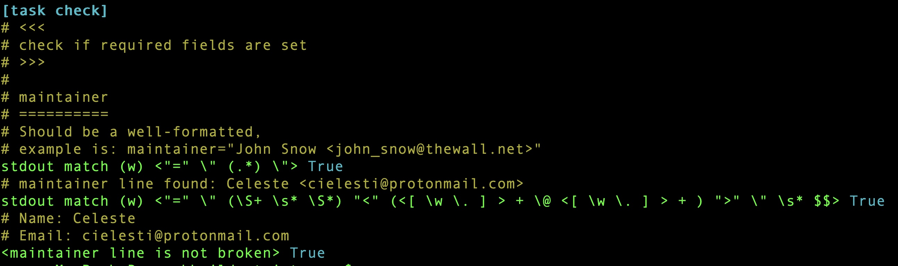
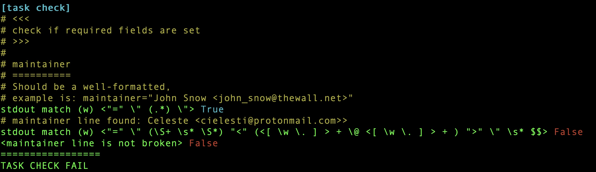
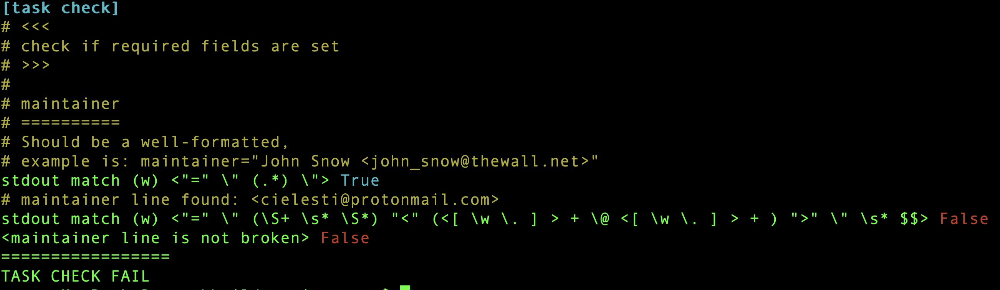

# apkbuild-strict

Example of validation of APKBUILD files using Sparrow6 Tack Checl DSL

# Install

```bash
% zef install Sparrow6 --/test

```
# How to run

```bash
% s6 --task-run .
```

# Report examples


## Maintainer ok



## Maintainer broken

Extra right angle bracket 



Extra left angle bracket 


Missing name



